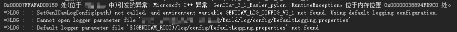
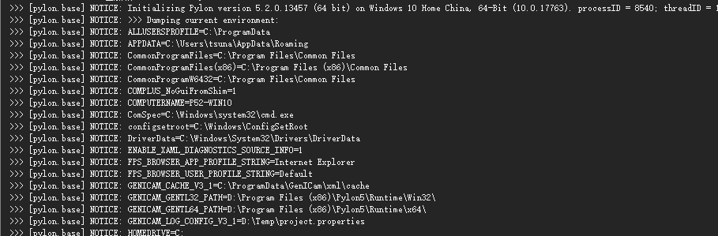

#如何开启Pylon的日志

在pylon 5中，如果你直接加载.h文件和.lib库，运行时，输出对话框就显示以下提示。

这就表示你没有设置日志输出的配置文件。按照以下步骤打开：

1. 下载[日志配置文件](Asset/DebugLogging.properties)，放到任意路径下。
2. 打开系统环境变量设置，配置 *GENICAM_LOG_CONFIG_V3_1* 为日志配置文件的完整路径+文件名。
2. 默认路径为{解决方案目录}/log/config/DefaultLogging.properties。

配置完成后再次运行程序。
